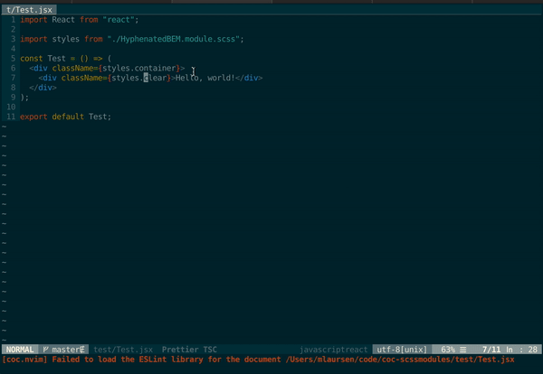

# coc-scssmodules

[coc.nvim] extension for `autocompletion` and `go-to-definition` functionality
for [CSS Modules].



Note: If you have `coc-tsserver` installed, the `go-to-defininition` might show
a popup instead linking to type definition for `*.module.s?css` instead. You'll
just need to select the `.css` file for this case since I don't know how to fix
it.

## Installation

```vim
:CocInstall coc-scssmodules
```

If you are using [vim's plugin manager for coc-extensions], here's an example
with [vim-plug]:

```vim
Plug 'mlaursen/coc-scssmodules', {'do': 'yarn install && yarn build'}
```

## Configuration

This extension supports two configuration properties:

```json
{
  "cssmodules.camelCase": {
    "type": ["boolean", "string"],
    "enum": [true, false, "dashes"],
    "default": false,
    "description": "Boolean if the suggestions should be converted to camelCase if you use kebab-case in css files. Should also work with sass parent selectors"
  },
  "cssmodules.hintMessage": {
    "type": "string",
    "default": "string (cssmodule)",
    "description": "The hint message to display next to an autocomplete suggestion from a css module"
  }
}
```

## Acknowledgements

This extension is essentially a port of [vscode-css-modules-plugin] and
[coc-cssmodules].

## Differences with [coc-cssmodules]

The main reason I created this implementation was to support [parent selectors]
within scss since I still like [BEM] for describing different states. If parent
selectors (`&`) are not a concern, you should use the "official"
[coc-cssmodules] instead.

Another small difference is that the `configuration` will be correctly typed
when using `:CocConfig` and show warnings when the `camelCase` option is valid
or invalid. (This could get ported into the "official" module as well though)

Finally, there is another configuration setting that can be used to show hint
details when the autocompletion items if you do not like the default value of
`string (cssmodule)`.

## TODO

Need to look into a way to actually write tests for this. None of the other
`coc-*` extensions have tests right now, so nothing really to reference. I could
write some tests for the utils and regexp at least.

Look into overriding/changing the `coc-tsserver` plugin for go-to-definitions so
this one is the "default" so it doesn't require a selection.

## Developing

Since I don't know a way to write automated tests yet with `coc.nvim`, the best
way to do this is:

- start the build watcher with `yarn build -w`
- update your `.vimrc` to disable/remove the downloaded `coc-scssmodules` and
  use a local path with something like [vim-plug] to open up one of the test
  files within the [test](./test)
  ```vim
  Plug '~/path/to/this-repo'
  ```
- open up one of the test files in [test](./test)
- open up the log with `:CocOpenLog`
- use the provided `this.logger` to log with `this.logger.info`
- whenever you make a change, run `:CocRestart` and `:CocOpenLog` to see changes

It's pretty ugly.

[coc.nvim]: https://github.com/neoclide/coc.nvim
[css modules]: https://github.com/css-modules/css-modules
[vim's plugin manager for coc-extensions]:
  https://github.com/neoclide/coc.nvim/wiki/Using-coc-extensions#use-vims-plugin-manager-for-coc-extension
[vim-plug]: https://github.com/junegunn/vim-plug
[coc-cssmodules]: https://github.com/antonk52/coc-cssmodules
[vscode-css-modules-plugin]: https://github.com/clinyong/vscode-css-modules
[parent selectors]:
  https://sass-lang.com/documentation/style-rules/parent-selector
[bem]: http://getbem.com/
